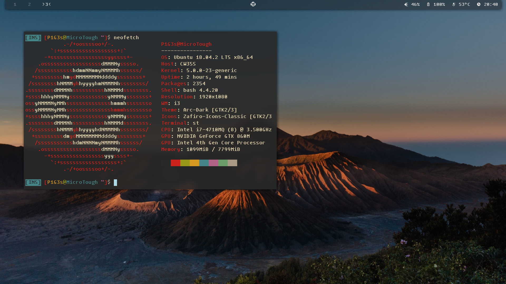

<<<<<<< HEAD
## What are these?

  Greetings sir, these are some of the **Dot Files** on my linux OS, and they are basically the backup in case i borke the system or hop to another distro. Since i have not yet accuired much knowledge of linux, **i can't promise that these files are in good quality**, but if you are interested, please feel free to try it and post any problems you might have encountered so that i can make things better. Here are some screenshots of my ricing
    
 
#### Overview:
=======
## Overview:
>>>>>>> 4ac8ba543c1dadb573262990ee58b6f28a826635

## Main Components
- **Window Manager**          :[i3-gaps](https://github.com/Airblader/i3)
- **File Browser**            :[ranger](https://github.com/ranger/ranger) (using Ueberzug to preview images)
- **Status Bar**              :[polybar](https://github.com/polybar/polybar)
- **Editor**                  :[neovim](https://github.com/neovim/neovim)
- **Terminal Simulator**      :[suckless terminal](https://github.com/LukeSmithxyz/st) (big thank to this good sir - [Luke Smith](https://www.youtube.com/channel/UC2eYFnH61tmytImy1mTYvhA))
- **Font**                    :[Tamzen](https://github.com/sunaku/tamzen-font) and [Zpix](https://github.com/SolidZORO/zpix-pixel-font)
- **Icon**                    :[siji](https://github.com/fauno/siji)(this is a ttf version of siji, original siji [here](https://github.com/stark/siji))
- **And More...**

	
