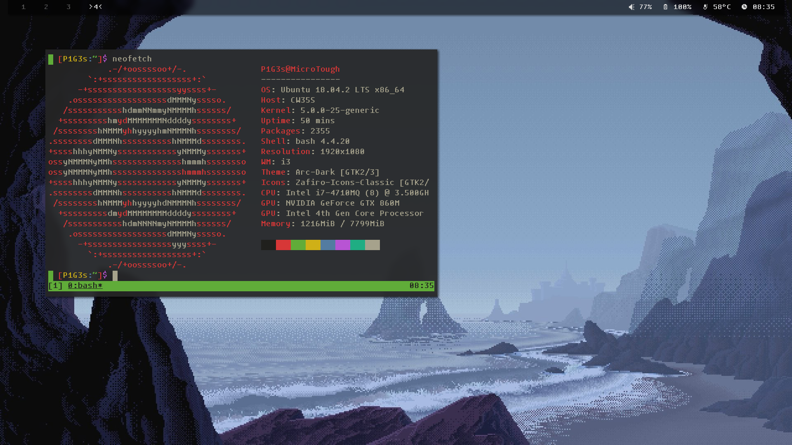

## WhAt aRe ThEsE???

  Greetings sir, these are some of my **Config Files** on linux OS, and they are basically the backup in case i borke the system or hop to another distro. Since i am a noob, **i can't promise that these files are in good quality**, but if you are interested, please feel free to try it and post any problems you might have so that i can make things better. Anyways, here are some screenshots of my ricing( i'm a fan of _**retro**_ things, so there might be tons of wierd stuffs), it's Pixel Time :D
    
 
#### Overview:

## Main Components
- **Window Manager**          :[i3-gaps](https://github.com/Airblader/i3)
- **File Browser**            :[ranger](https://github.com/ranger/ranger)(currently using Ueberzug to preview images)
- **Status Bar**              :[polybar](https://github.com/polybar/polybar)
- **Editor**                  :[neovim](https://github.com/neovim/neovim)
- **Terminal Simulator**      :[suckless terminal](https://github.com/LukeSmithxyz/st) (big thank to this good sir - [Luke Smith](https://www.youtube.com/channel/UC2eYFnH61tmytImy1mTYvhA), who shows me lots of great stuff)
- **Font**                    :[Tamzen](https://github.com/sunaku/tamzen-font) and [Zpix](https://github.com/SolidZORO/zpix-pixel-font)
- **Icon**                    :[siji](https://github.com/fauno/siji)(this is a ttf version of siji, original siji [here](https://github.com/stark/siji))
- **And More...**

## Scripts
  I try writing some very basic scripts with my limited shell knowledge, just for convenience :P
- **chsrc**                    :helps me change the apt source file when i'm not experiencing hyperspeed downloading
- **chbkg**                    :helps me change wallpaper more easily, i have it bound to the key "bg" in ranger so that i can change wallpaper right in the ranger (just simply type bg with the selected image in ranger)
